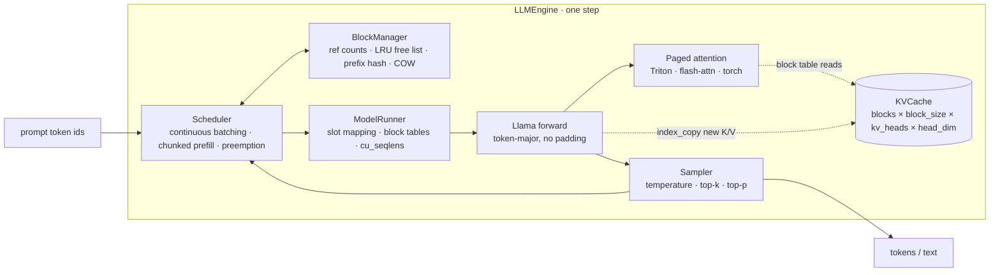

<div align="center">

# paged-llm

### A small LLM inference engine whose attention really reads through the block table

Block manager, continuous-batching scheduler, hash-based prefix caching and a
Triton paged-attention kernel, wired into a Llama forward pass that loads
HuggingFace checkpoints and benchmarked against HF `generate` and vLLM.

[](https://github.com/xiyiji/paged-llm/actions/workflows/ci.yml)


`PagedAttention` · `continuous batching` · `chunked prefill` · `prefix caching`
· `copy-on-write` · `recompute preemption` · `Triton`

</div>

Most "learn vLLM by rebuilding it" projects keep the block table as
bookkeeping and gather the KV cache back into contiguous tensors before
calling standard attention. This one does not: the attention kernel takes the
block table and resolves `block_table[pos // block_size]` per key row, so the
memory layout that makes paging worthwhile is the layout the GPU actually
reads. Everything above the kernel is deliberately narrow and deep — no
monitoring, no distributed — so each layer can be tested to the token.

Companion repositories: [InferenceGateway](https://github.com/xiyiji/InferenceGateway)
(Ray Serve in front of vLLM, the production-shaped data plane) and
[llm-serving-platform](https://github.com/xiyiji/llm-serving-platform) (the
gateway / control plane). This repository is the engine you would build to
understand what those two are calling.

## Architecture



One forward pass per step serves every scheduled sequence at once: a decoding
sequence contributes one query token, a prefilling one contributes up to the
remaining token budget. The kernel derives each query's absolute position from
`seq_len_k - num_q + i`, so prefill, chunked prefill and decode are the same
call.

## Technology stack

| Layer | Technology | Responsibility |
|---|---|---|
| Attention kernel | Triton 3.x, online softmax, GQA head mapping | Reads K/V through the block table; prefill and decode in one kernel |
| Alternative backends | flash-attn ≥ 2.6 varlen + `block_table`, pure PyTorch | Same signature; the PyTorch one is the CPU-runnable oracle |
| KV memory | Ref-counted fixed-size blocks, LRU free queue, `hash(prev_hash, tokens)` prefix cache, copy-on-write | Sharing across requests without copies; eviction only when the pool is full |
| Scheduling | Token-budgeted continuous batching, chunked prefill, recompute preemption, FIFO admission | Mixed prefill/decode batches; lossless recovery under memory pressure |
| Model | Llama-2/3/3.x/TinyLlama in PyTorch, HF safetensors loader, Llama-3 RoPE scaling | Token-major forward with no padding |
| Startup | vLLM-style profiling forward | Sizes the KV pool from what is left under `gpu_memory_utilization` |
| Benchmarks | HF `generate`, vLLM, NVML sampling, equal and ragged workloads | Throughput and capacity on one GPU, one process per run |
| Verification | pytest, GitHub Actions (CPU), GPU suite | Token-exact parity against dense recomputation and against HF |

## Capability matrix

| Capability | Status | Scope |
|---|---|---|
| Triton paged attention (prefill, chunked prefill, decode, GQA, fp16/bf16) | Implemented · 61 GPU tests vs reference | `pagedllm/attention/triton_kernel.py` |
| Block manager with prefix caching and copy-on-write | Implemented | `pagedllm/block_manager.py` |
| Continuous batching with chunked prefill and preemption | Implemented | `pagedllm/scheduler.py` |
| Llama forward loading HF checkpoints | Implemented · TinyLlama parity vs HF | `pagedllm/model/` |
| Memory profiling to size the KV pool | Implemented | `LLMEngine._profile_num_blocks` |
| Benchmarks vs HF `generate` and vLLM | Measured on RTX 4090 | `benchmarks/`, tables below |
| CUDA graphs | Not implemented | The largest gap to vLLM at small batch |
| Split-K decode kernel | Not implemented | Decode pads 1-token queries to a 16-row tile |
| Swap-based preemption, speculative decoding, quantised KV, tensor parallel, HTTP server | Not implemented | Out of scope on purpose |

## Quick start

```bash
pip install -e ".[gpu,dev]"          # torch + triton
python examples/generate.py --model TinyLlama/TinyLlama-1.1B-Chat-v1.0
```

```python
from pagedllm import EngineConfig, SamplingParams
from pagedllm.engine import LLMEngine

engine = LLMEngine("meta-llama/Llama-3.2-1B-Instruct", EngineConfig(attention_backend="triton"))
for out in engine.generate(["Paged attention is"], SamplingParams(temperature=0.0, max_tokens=64)):
    print(out.text, out.num_cached_tokens)
```

## Benchmarks

RTX 4090 · TinyLlama-1.1B-Chat fp16 · 64 requests · greedy · EOS ignored ·
output tokens/s counting only each request's target tokens. Full tables with
memory columns in [`benchmarks/results/latest.md`](benchmarks/results/latest.md),
raw records in the `.jsonl` next to it.

**Equal lengths** (256 in / 128 out — the best case for static batching):

| batch | HF `generate` | paged-llm | vLLM 0.29 |
|---:|---:|---:|---:|
| 1 | 146 | 135 | 357 |
| 8 | 1026 | 1015 | 2238 |
| 32 | 3370 | 3467 | 6128 |
| 64 | 5388 | 5827 | 8126 |

**Ragged lengths** (input 64–256, output 32–128, random order — static batching
pads to the longest prompt and keeps decoding until the longest output is done):

| batch | HF `generate` | paged-llm | vLLM 0.29 |
|---:|---:|---:|---:|
| 32 | 1835 (53% wasted decode steps) | 2691 | 4556 |
| 64 | 2096 (55% wasted decode steps) | 4210 | 6063 |

**75% shared prefix**, batch 32: paged-llm 3744 (48 prefix-cache hits, vs 3467
without sharing), vLLM 7292.

**Kernel micro-benchmark** (Llama-3-8B attention shape: 32 heads / 8 KV heads /
head_dim 128, fp16, block 16, microseconds per call; full table in
[`benchmarks/results/kernel.md`](benchmarks/results/kernel.md)):

| workload | Triton (this repo) | PyTorch gather-then-attend |
|---|---:|---:|
| prefill, 2048 tokens | 526 | 6568 |
| decode, batch 8 × 512 context | 50 | 1350 |
| decode, batch 1 × 8192 context | 445 | 931 |

How to read this honestly:

* **vs HF `generate`**: on equal lengths the two are within ±8% — there is
  nothing for continuous batching to win. On ragged lengths paged-llm is 1.5×
  (batch 32) to 2.0× (batch 64) faster because HF spends over half of its
  decode steps on rows that already finished.
* **vs vLLM**: paged-llm reaches 46–72% of vLLM's throughput. The causes, in
  order: no CUDA graphs (at batch 1 vLLM is 2.6× faster purely from launch
  overhead), a decode kernel that pads each 1-token query to a 16-row tile and
  does not split long contexts across SMs (batch 1 × 8192 above is only 2×
  the reference), and no fused RMSNorm / RoPE / SiLU kernels. vLLM ran from a
  separate environment (torch 2.13, CUDA graphs on); paged-llm and HF on torch
  2.8.
* **Memory**: paged engines pre-allocate the KV pool, so peak memory is not
  comparable to HF. The meaningful numbers are capacity (818k tokens on a 4090
  for this model) and zero preemptions across every run.

Reproduce with `bash scripts/gpu_run.sh` on a CUDA machine (`VLLM_PYTHON` may
point at a separate interpreter that has vLLM).

## Tests

```bash
pytest -q                                                       # CPU: 29 tests
pytest -q tests/test_triton_kernel.py tests/test_model_gpu.py   # GPU: 66 tests
```

The CPU suite runs the *whole* engine — scheduler, block manager, KV cache,
attention, sampling — on a tiny random Llama and checks it reproduces dense
recomputation token-for-token, including under forced preemption, with
prefix-cache hits, and after fork + copy-on-write. `test_hf_parity_cpu.py`
builds a tiny checkpoint with transformers' own `LlamaForCausalLM`, loads it
through this engine and compares greedy output with `model.generate`, so weight
loading and the RoPE convention (including Llama-3 scaling) are verified without
a GPU.

The GPU suite checks the Triton kernel against the PyTorch reference over
prefill / decode / mixed batches, GQA shapes, fp16 and bf16, then runs
TinyLlama and compares logits and greedy output with HuggingFace.

## Design notes

* **One kernel for prefill and decode.** vLLM v1 schedules prefill chunks and
  decode tokens into the same forward; the kernel takes `cu_seqlens_q` and
  `seq_lens_k` and derives causal masking from the absolute position. The cost
  is the padded decode tile, which the benchmark quantifies.
* **Hash-based prefix caching, not a radix tree.** Full blocks are hashed as
  `hash(prev_block_hash, tokens)`; lookups are dict probes and eviction is the
  LRU free queue. SGLang's radix tree gives token-level sharing at the price of
  a tree walk; vLLM chose the hash. A fully cached prompt still computes its
  last token so there are logits to sample from.
* **Preemption is recompute, not swap.** Generated tokens are kept and the
  request re-enters the queue as a longer prompt — lossless, and what vLLM v1
  does by default.
* **Copy-on-write on shared partial blocks.** Forked sequences share every
  block; the first write into a shared, partially filled block allocates a
  private copy and the runner performs the physical copy before the forward.
* **Memory sizing.** One max-batch forward at startup measures the activation
  peak; everything under `gpu_memory_utilization` that is not weights or
  activations becomes KV blocks.

## Repository layout

```
pagedllm/
  block_manager.py      blocks, ref counts, prefix cache, copy-on-write
  scheduler.py          continuous batching, chunked prefill, preemption
  kv_cache.py           per-layer K/V pools, slot writes, block copies
  attention/            triton_kernel.py · flash_backend.py · reference.py
  model/                llama.py (token-major forward) · loader.py (HF safetensors)
  engine.py             LLMEngine, ModelRunner, memory profiling
  sampler.py            vectorised temperature / top-k / top-p
benchmarks/             bench.py (HF · paged-llm · vLLM) · bench_kernel.py · results/
tests/                  CPU suite (runs in CI) · GPU suite
scripts/                runpod_setup.sh · gpu_run.sh
```
